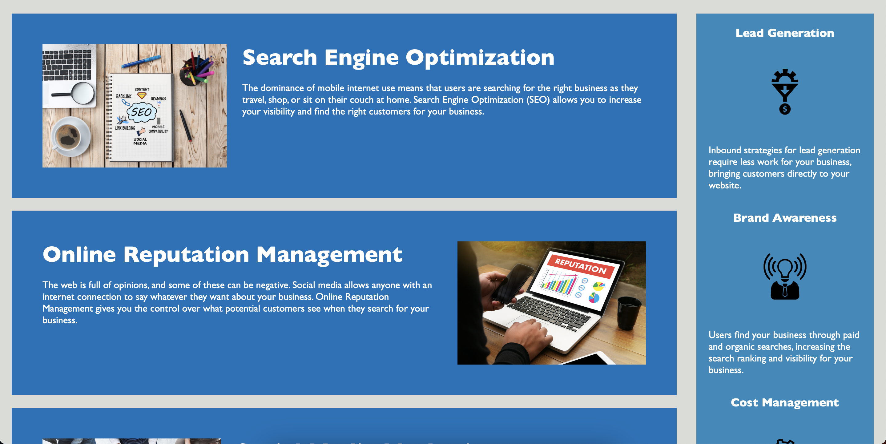
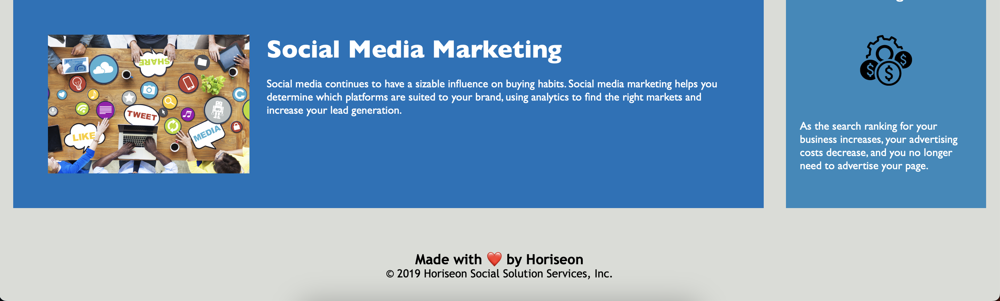

# marketing-agency-horiseon

## Description

First bootcamp challenge - Horiseon Marketing Agency. The challenge begins with starter code and later is modified to make the website more accessible. Below I'd like to list some of the things I've changed:

HTML:

1. Changed sites title to Marketing Agency Horiseon
2. Added alt text to images for accessability purposes
3. Added breaks for clarity so it's easier to read the code
4. Changed all div tags to appropriate semantic tags

CSS:

1. Consolidated CSS code for benefits section into benefit-block
2. Consolidated CSS code for content section into content-block
3. Moved around CSS code so content wise it reflects HTML and follows each other (In my opinion better to follow the content)
4. Changed div to nav tag that required me to change CSS divs to navs to make sure my navigation list on the website looks the same as example

At first when consolidating files I didn't understand why certain parts don't work but then I realised that I should add (i.e h2 or img extensions to my selectors to catch all the components)

## Link

https://grazulisedgars.github.io/marketing-agency-horiseon/

## Screenshot

## License

MIT
